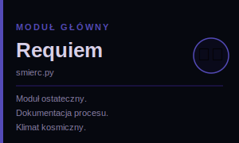
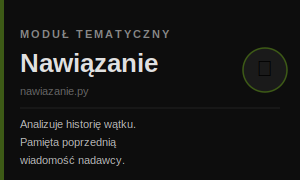
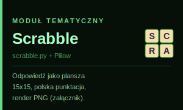
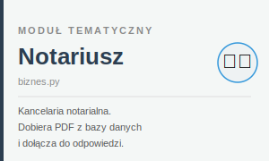
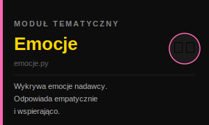

# 🤖 AutoResponder AI Text — Tyler v6

> **Autor:** [Paweł](https://github.com/legionowopawel?tab=repositories)  
> **Demo:** [legionowopawel.github.io/AutoResponder_AI_Text](https://legionowopawel.github.io/AutoResponder_AI_Text/)  
> **Backend:** Flask na Render.com | **Trigger:** Google Apps Script

---

## Czym jest ten projekt?

System automatycznie odbiera e-maile, analizuje je przez AI i odsyła inteligentną odpowiedź — bez udziału człowieka. Każdy moduł (zwany *responderem*) ma inny styl, charakter i cel.

---

## 🔄 Jak działa pipeline (krok po kroku)

```
Gmail → GAS → Flask/Python → DeepSeek AI → odpowiedź → Gmail
```

### 1. ⚙️ GAS — Google Apps Script (Sekretarka)
Skanuje skrzynkę Gmail co kilka minut. Gdy znajdzie nową wiadomość:
- sprawdza czy nadawca nie jest na czarnej liście (`BANNED_EMAILS`)
- zapisuje zdarzenie do Google Sheets (status: `ODEBRANO`)
- wysyła webhook do serwera Flask na Render.com
- jeśli serwer nie odpowie w 25 sekund — ponawia próbę (max 3 razy)

### 2. 🐍 Flask — serwer Python (`app.py`)
Serce systemu. Odbiera webhook, natychmiast zwraca `200 OK`, a potem w tle:
- wykrywa płeć i imię nadawcy (`wykrywaczplci`)
- buduje plan zadań (`PipelineBuilder`) na podstawie flag z GAS
- uruchamia odpowiednie respondery jako wątki daemon
- pilnuje deduplikacji (ten sam e-mail nie zostanie przetworzony dwa razy)
- loguje postęp do Google Sheets i Google Drive

### 3. 🤖 AI Analysis — DeepSeek
Każdy responder wywołuje model DeepSeek (V3 lub R1) z dedykowanym promptem. AI:
- rozumie intencję nadawcy
- przyjmuje zadaną personę (np. Tyler Durden, Eryk Dociekliwy)


### 4. ✉️ Response — wysyłka
Gotowa odpowiedź jest pakowana w HTML i wysyłana przez SMTP/Gmail API. Render wysyła bo Script ma tylko 6 min na odp.  
GAS otrzymuje potwierdzenie i oznacza wątek jako `WYSŁANO`.

---

## 🎭 Respondery (moduły)

### Główne

| Moduł | Persona | Styl |
|---|---|---|
| **Tyler Durden**  | `zwykly.py` | Bezpośredni, bez owijania w bawełnę. Zero zbędnych uprzejmości. |
| **Eryk Dociekliwy** | `dociekliwy.py` | Zadaje trafne pytania pomocnicze, analizuje intencje nadawcy. |
| **Requiem**  | `smierc.py` | Moduł "ostateczny" — klimat kosmiczny, dokumentacja procesu. |

### Tematyczne

| Moduł | Plik | Co robi |
|---|---|---|
| **Nawiązanie**  | `nawiazanie.py` | Analizuje historię wątku mailowego i nawiązuje do poprzedniej wiadomości. |
| **Scrabble**  | `scrabble.py` | Generuje odpowiedź jako wizualną planszę Scrabble (PNG, Pillow, punktacja PL). |
| **Notariusz**  | `biznes.py` | Responder kancelarii notarialnej — dołącza odpowiedni PDF z bazy. |
| **Emocje**  | `emocje.py` | Wykrywa emocje nadawcy i wysyła wspierającą, empatyczną odpowiedź. |
| **Generator PDF** | `generator_pdf.py` | Tworzy i dołącza spersonalizowany dokument PDF. |

---

## 🏗️ Architektura techniczna

```
app.py
├── /webhook          ← odbiera maile z GAS
├── /                 ← status systemu (HTML + JSON)
├── /debug            ← podgląd ostatniego pipeline (auto-refresh 15s)
├── /status           ← JSON API ze stanem systemu
└── /oauth/...        ← autoryzacja Google OAuth2

core/
├── responder_manager.py   ← konfiguracja i zarządzanie responderami
├── job_runner.py          ← równoległe uruchamianie sekcji pipeline
├── resource_manager.py    ← monitoring RAM i limity współbieżności
├── validator.py           ← walidacja przychodzących e-maili
├── wykrywaczplci.py       ← detekcja imienia i płci nadawcy
└── logging_reporter.py    ← logowanie sesji

responders/
├── zwykly.py, smierc.py, biznes.py
├── scrabble.py, emocje.py, nawiazanie.py
├── dociekliwy.py, generator_pdf.py
└── ...
```

---

## 🔑 Słowa kluczowe (triggery)

GAS wykrywa słowa kluczowe w temacie lub treści maila i ustawia odpowiednie flagi:

| Hasło | Efekt |
|---|---|
| `**zapytać autora**` | Aktywuje responder Tyler |
| `**zapytać autora**` | Uruchamia moduł Requiem relacji z podróży w kosmosie |
| `scrabblescrabble` | Generuje planszę Scrabble |
| `pdfpdf` | Tworzy załącznik PDF |

---

## ⚙️ Technologie

- **Python 3** — Flask, threading, psutil
- **Google Apps Script** — trigger czasowy, Gmail API, Sheets, Drive
- **DeepSeek AI** — analiza tekstu i obrazów (V3/R1)
- **Pillow** — generowanie obrazów PNG (moduł Scrabble)
- **OAuth 2.0** — autoryzacja Google
- **Render.com** — hosting serwera Flask (free tier, 512 MB RAM)

---

## 📊 Monitoring

Panel statusu dostępny pod adresem głównym serwera pokazuje:
- zużycie RAM procesu i kontenera
- aktywne pipeline'y
- listę włączonych/wyłączonych responderów
- historię ostatnich 1 pipelin który aktualnie jest obsługiwany (wygasa w ciągu 15 min z powodu Render free)
- ostatni błąd systemu

---

*Projekt hobbystyczny — Paweł, Legionowo 2026*
